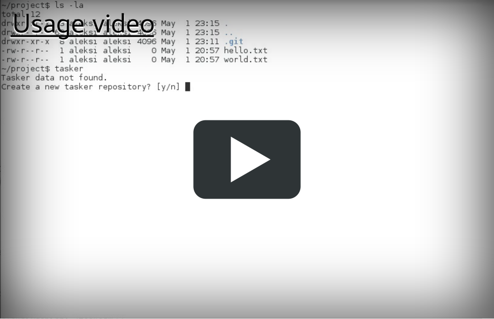

Tasker
======

This projects goal is to create simple task management software.
It stores all data in json files and uses git for tracking
the changes.

The data is stored in following directory structure:
 * tasks.json <-- array of tasks
 * tasker.conf <-- configuration file

TODO the following structure would be nice:
 * tasks
   * task #1
   * ...
 * types
   * task type #1
   * ...
 * users
   * user #1
   * ...
 * remotes
 * tasker.conf <-- configuration file

Why json?
=========

Json is simple way to store data. It can be extendable with still
being backwards and forwards compatible.  Json is also human-
readable so you can always read the data with text editor and
possibly fix corruption or bug by manually editing the text
file.

Why git?
========

It's important to have backups of your issues, It's nice to be able to see
the issues even if you are offline. Both can be accomplished with proper
version control. I decided to use git just because it's decentralized and
It's only version control that I have used for now.

Readline
========

The tasker uses readline to get nicer input fields, but the Readline doesn't
free the memory before exit so you can compile the project with flag `_NO_READLINE_`
to disable readline. This is useful while debugging memory leaks.

TODO
====

Currently the code uses handmade git and json handling code, but
it would be better to use proper json library and c++ wrapper for
libgit2. Also proper unit testing framework is needed.
